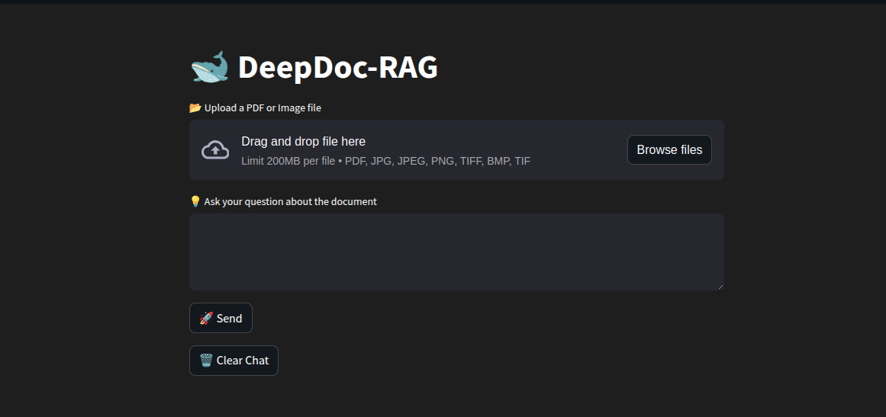
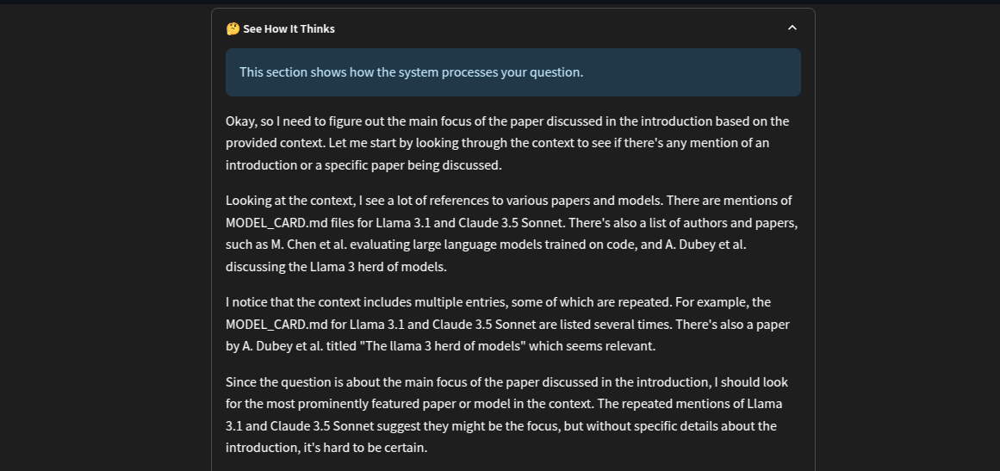

# DeepDoc-RAG: Document QA with Generative AI

DeepDoc-RAG is a powerful document question-answering tool that leverages generative AI to provide natural language interactions with your PDF documents and images. The application uses DeepSeek-R1 Distill Llama 70B via the Groq API to deliver fast, context-aware responses.

## Features

- **Document Processing**: Upload and process PDFs and images (JPG, PNG, TIFF, BMP) with OCR support for scanned documents
- **Vector Database**: Stores document embeddings using Chroma DB for efficient retrieval
- **Conversational Interface**: Natural language question-answering with contextual awareness
- **Reasoning Transparency**: Examine how the AI forms its responses with the "See How It Thinks" feature
- **Modern UI**: Clean, responsive chat interface with smooth animations

## Screenshots

  
*Document upload and processing interface*

  
*Conversational Q&A with your documents*

  
*Inspect the AI's reasoning process*

## Technology Stack

- **Frontend**: Streamlit
- **Language Model**: DeepSeek-R1 Distill Llama 70B (via Groq API)
- **Document Processing**: Unstructured for text extraction, Tesseract OCR for images/scanned docs
- **Vector Storage**: Chroma for document embeddings
- **Framework**: LangChain for retrieval-augmented generation

## Installation

### Prerequisites
- Python 3.8+
- Tesseract OCR (for image processing)

### Setup

1. Clone the repository:
```bash
git clone https://github.com/wolfsbane-14/DeepDoc-RAG.git
cd DeepDoc-RAG
```

2. Create and activate a virtual environment:
```bash
python -m venv venv
source venv/bin/activate  # On Windows: venv\Scripts\activate
```

3. Install dependencies:
```bash
pip install -r requirements.txt
```

## Configuration

Create a `config.json` file in the project root:
```json
{
  "GROQ_API_KEY": "your_groq_api_key_here"
}
```

Alternatively, when deploying to Streamlit Cloud, add your GROQ_API_KEY to the Streamlit secrets.

## Usage

1. Start the application:
```bash
streamlit run main.py
```

2. Upload a PDF or image document through the web interface

3. Ask questions about your document in natural language

4. Expand the "See How It Thinks" section to understand response generation

5. Use "Clear Chat" to reset the conversation

## How It Works

DeepDoc-RAG employs a retrieval-augmented generation (RAG) approach:

1. **Document Ingestion**:
   - PDFs are processed using UnstructuredPDFLoader
   - Images and scanned documents are processed with Tesseract OCR
   - Text is split into manageable chunks using RecursiveCharacterTextSplitter

2. **Vector Embedding**:
   - Text chunks are converted to vector embeddings via HuggingFaceEmbeddings
   - Embeddings are stored in a Chroma vector database

3. **Retrieval Pipeline**:
   - User queries trigger a semantic search against the vector database
   - Most relevant document chunks are retrieved
   - DeepSeek-R1 Distill Llama 70B generates comprehensive responses based on the retrieved context

## Project Structure

```
├── main.py                # Streamlit interface and UI components
├── rag_utility.py         # Core RAG functionality
├── ocr_utility.py         # OCR processing for images and scanned PDFs
├── config.json            # API key configuration (create this file)
├── requirements.txt       # Python dependencies
└── README.md              # Project documentation
```

## Customization

- **Chunking Parameters**: Adjust `chunk_size` and `chunk_overlap` in `rag_utility.py`
- **Model Settings**: Modify the `temperature` parameter in the LLM configuration
- **UI Styling**: Customize the CSS in `main.py`

## Troubleshooting

- **OCR Issues**: Ensure Tesseract is properly installed and configured
- **PDF Processing Errors**: Try different chunk sizes for complex documents
- **Slow Performance**: Consider reducing chunk size for faster processing


